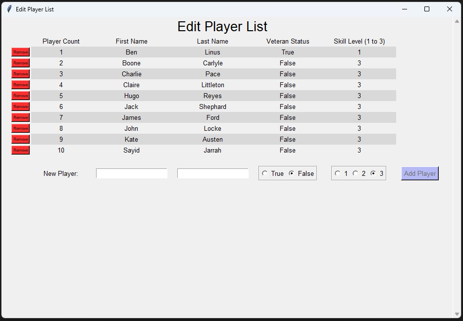

# Group-Maker
An application for creating random groups for sports.

### Brief Application Guide:
- Select the players that will be attending the event, adjust settings, and then click "Create Groups".

### Features:
- After groups are generated, players can be manually swapped in the group display window.
- There is a button in the group display window that copies the current list of groups to the computers clipboard. From here, the list can be pasted into a message, text file, etc.
- This application can be run using the executable file located within the "dist" folder. Note that this file might not contain the latest updates.

### Installation and Execution Instructions:
- Python version 3.10 may need to be downloaded and installed.
- Download the ZIP folder from GitHub and extract.
- If running the application from the executable file, the file can be found within the "dist" folder. Note that a CSV file will be created when running the executable if no CSV file exists already.
- The application can also be run through Python/Pipenv. Use `pipenv install` to install the dependencies, and then use `pipenv run python main.py` to run the program.
- To ensure that the executable file is up to date, a new executable file can be created using Pyinstaller. To do this, run `pipenv run pyinstaller main.py --onefile -w`. The new executable file should be located in the "dist" folder. Note that the `-w` flag is used to prevent the command prompt from popping up in the background when the executable file is started.
- When running the executable on Windows, the file might be seen as a virus. One solution for this problem is to add the executable file path to an exclusion list so that Microsoft Defender Antivirus doesn't scan the file. To do this in Windows, search for "Virus & threat protection". Within the "Virus & threat protection settings" section, click on "Manage settings", and then in the "Exclusions" section, select "Add or remove exclusions". Add the executable file path. Note that this part is only necessary if Windows' antivirus protection is giving warnings, etc.

### Antivirus Issues:
- Windows' antivirus protection might stop the ZIP folder from being downloaded or accessed. The root cause of this problem is the existence of the executable file within the "dist" folder. To prevent this issue, the dist folder containing the executable file has been removed from the repository. To access this executable file, it can be found in previous commits. You can try downloading the commit from February 28, 2024 (f84e0fc95cca8811168c77314dc19100d4738981).
- Remember that the executable file can also be created after downloading the ZIP folder.

### Screenshots:

